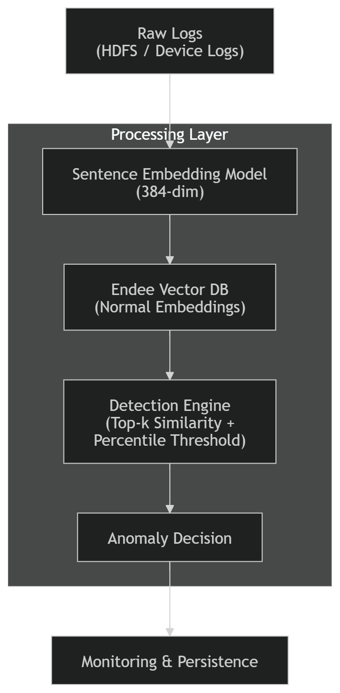

# AI Pattern Investigator

### Real-Time Log Anomaly Detection Using Vector Retrieval

An end-to-end streaming anomaly detection system where a vector database acts as the semantic memory and decision engine.

Anomaly detection is reframed as a **similarity retrieval problem** instead of a classifier.

---

## 🎯 Core Idea

If a log embedding cannot retrieve sufficiently similar *normal* embeddings, it is considered anomalous.

The system stores **normal embeddings only**, and similarity acts as a confidence signal.

---

## 🏗 System Architecture

---

## 🧠 Detection Logic

For each log:

1. Generate a 384-dimensional sentence embedding
2. Retrieve top-k nearest neighbors from normal embeddings
3. Compute cosine similarity
4. Compare against threshold derived from held-out normals
5. Flag as anomaly if similarity is below threshold

---

## 🔄 Operating Modes

### Offline Validation

* Build embedding index from normal HDFS logs
* Evaluate on labeled failure logs
* Measure ROC-AUC, recall, and false positive rate

### Real-Time Streaming

* Logs ingested via Kafka
* Embeddings generated in batches
* Vector similarity queried per log
* Decisions persisted to SQLite
* Sliding-window metrics tracked

---

## 📊 Performance Evaluation

### HDFS Trace Dataset (Real Failures)

| Metric                | Value          |
| --------------------- | -------------- |
| ROC-AUC               | 0.97           |
| Recall (Failure Logs) | 0.95           |
| False Positive Rate   | 0.013          |
| Vector Query Latency  | 6.5 ms per log |
| Embedding Dimension   | 384            |

These results indicate strong separability between normal and failure logs using similarity-based retrieval.

### Synthetic Anomaly Evaluation

| Metric               | Value          |
| -------------------- | -------------- |
| ROC-AUC              | 0.84           |
| Recall               | 0.68           |
| False Positive Rate  | 0.013          |
| Vector Query Latency | 6.7 ms per log |

Performance varied depending on semantic distance and vocabulary shift, highlighting sensitivity to distribution drift.

## 🔍 Explainability

Each anomaly includes:

* Top-k closest normal logs
* Similarity scores
* Distance from threshold

This enables **interpretable anomaly alerts** instead of black-box decisions.

---

## 🛠 Tech Stack

* Python
* Transformer-based sentence embeddings (384-dim)
* Endee Vector DB
* Apache Kafka
* Docker
* Streamlit

---

## 📌 Use Cases

* Distributed system monitoring
* Failure detection in logs
* DevOps anomaly tracking
* Security log analysis
* Behavioral drift detection

---

## 💡 Design Philosophy

This system reframes anomaly detection:

* **Not classification. Not reconstruction.**
* **Similarity-based confidence estimation over semantic memory.**
* Vector retrieval acts as the decision layer.
